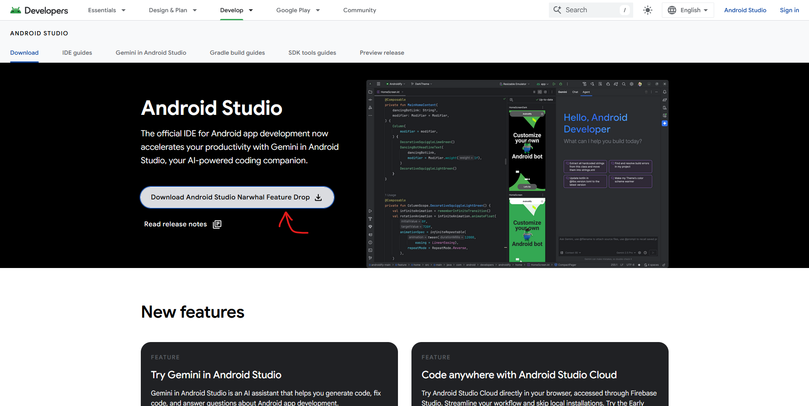
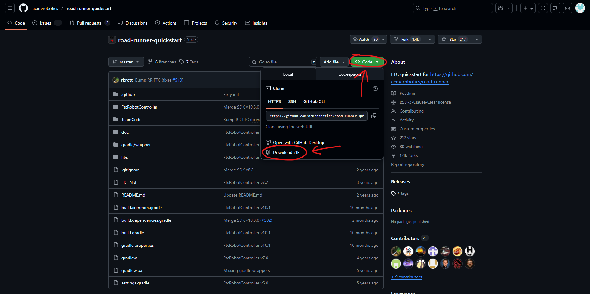
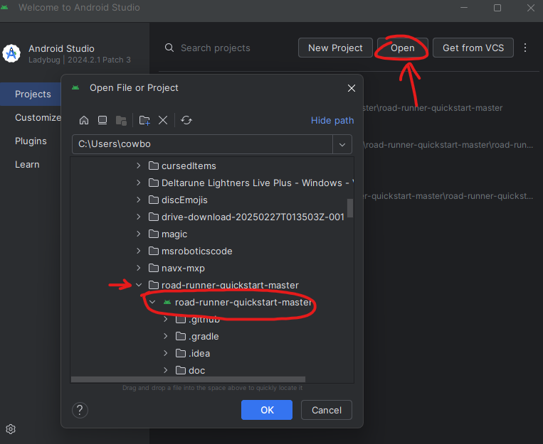

# Code Setup

This page will show you how to install and setup Andriod Studio as well as road runner for properly setting up field centric drive.
You may also find the NavX Calibration page helpful if you're working on field centric drive.

# Installing Andriod Studio
To start, you're going to need to install Andriod Studio. Go to [https://developer.android.com/studio](https://developer.android.com/studio) and click the download button.

Accept the terms and agreements at the bottom and download the install file. Once the file is downloaded, click it to open it.
Depending on your device, follow the instructions to install Andriod Studio.

# Downloading and Opening Road-Runner
After installing Andriod Studio, you need to get the code framework we use called: [Road-Runner](https://github.com/acmerobotics/road-runner-quickstart/tree/master) by ACME Robotics. 
To download it, go to [https://github.com/acmerobotics/road-runner-quickstart/tree/master](https://github.com/acmerobotics/road-runner-quickstart/tree/master) and download the files. 

Once you've downloaded the .zip file, go into your file manager and unzip the file. Now, open up Andriod Studio. If you haven't downloaded Andriod Studio yet, install it now!
When Andriod Studio Launches, press open and find the road-runner folder. If you need too, expand the road-runnner folder then click on the file with the green icon next to it.

Wait for Andriod Studio to launch the file, once it's finished you can find all important code files in TeamCode>java>org>firstinspires>ftc>teamcode  
You should also create new files in the same folder :)  
<small>(Note: It may also look like TeamCode>java>org,firstinspires.ftc.teamcode, each period is just indicating another folder)</small>

### Note on Field Centric Drive
If you're working on field centric drive, you should take a look at the NavX Calibration page. As well as the NavX Setup page :)

[Home Page](https://potatzz.github.io/ms-robotics-resources.github.io/) || [Table of Contents](https://potatzz.github.io/ms-robotics-resources.github.io/table_of_contents.html)
