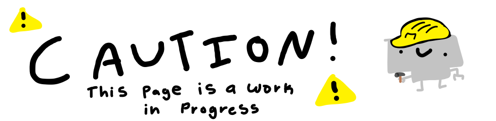
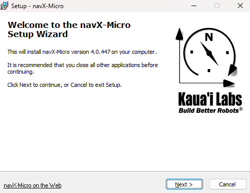

# NavX Intro

The NavX is what we mainly use to have field centric drive. We specifically use the NavX2 Micro and you can see it on the left-hand side of our robot from last year!  
The NavX is essetially just a gyroscope and a accelorometer combined. Or as [their website](https://pdocs.kauailabs.com/navx-micro/) says, it's "a second-generation **9-axis inertial/magnetic sensor** and **motion processor.**"  
Last year, we found out the the NavX can get disoriented and sometimes needs to be recalibrated, so if thats what you're trying to do, then you're in the right place!  

# ***THE APPLICATION USED IN THIS PAGE IS FOR WINDOWS ONLY***

# NavX Calibration
To calibrate the NavX you're going to need to download the NavX UI.  
First go to [https://pdocs.kauailabs.com/navx-micro/software/navx-ui/](https://pdocs.kauailabs.com/navx-micro/software/navx-ui/), and click the large purple download button on the right.  
  
It should start to download a .zip file. Wait for it to finish downloading and open it. Unzip the .zip file, and then run the setup.exe file.  
If Windows warns you about running the file, **ignore it** <3. Then follow the instructions on screen to install the software. Allow the software to install the Driver as well!  

After the software has installed, you can launch it! If you don't know how to launch it, go to [this page](https://potatzz.github.io/ms-robotics-resources.github.io/opening_software_with_windows_key.html) on how to launch files with no shortcut.
Specifically, you should launch the NavX Config **as an administrator**. When the software launches, plug in the NavX into one of the USB-A ports.  
The software should automatically detect that something is plugged into the USB port, press open and you should see a bunch of numbers apear. 

[image]

(untested)
To calibrate the NavX, go to Advanced>Start Calibration(?). Slowly and steadily, rotate the NavX so that both sides of the NavX face the floor. Once the software detects the correct movements, it will be finished. 
If you would like, you can run the calibration multiple times for better accuracy.
  
[Home Page](https://potatzz.github.io/ms-robotics-resources.github.io/) || [Table of Contents](https://potatzz.github.io/ms-robotics-resources.github.io/table_of_contents.html)
