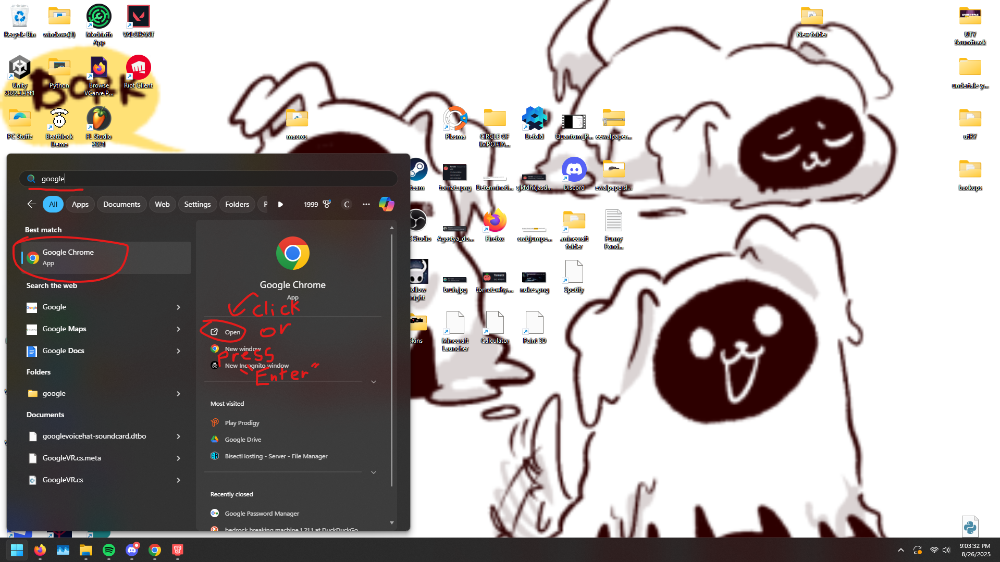

# Opening Software Without a Shortcut
**This page only applies to people who are using Windows!**
 
This page will teach you how to open up software with the Windows key! It's very helpful if you need to open an application that didn't or doesn't have a premade shortcut.
 
First, press the key that looks like the Windows logo on your keyboard. It should open up a big search box on your screen with some application icons below.\
To launch an app, just start to type in its name. When the application's icon shows up, either click "Open" or you can just press Enter on your keyboard.
 

 
 
 
[Home Page](https://potatzz.github.io/ms-robotics-resources.github.io/) || [Table of Contents](https://potatzz.github.io/ms-robotics-resources.github.io/table_of_contents.html)
